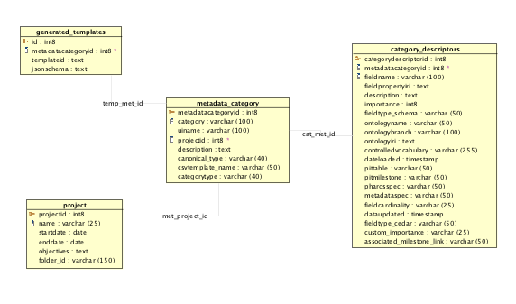

# FairApis

This repository contains various endpoints that are used to Generate JSON-Schemas from Database

## Included Folders ##

1. code: This includes all the code (written in Java)
2. DB: includes DB Schema and some Examples
3. examples: inlude some examples to generate and some generated Schemas

## Endpoints included ##

1. projects: Lists all projects taht are in DB
2. metadataCategories: List all metadata categories such as (cell line, Antibodies, Small molecules)
3. schemaGenerator: Generate the Schema for a Metadata categorie
4. schemaValidator: Validates the schema generated
5. templateCreator: Creates the Cedar Template based on the generated and validatied schema (use it if you want to commit the temple to cedar)
6. downloadCsvTemplate: Creates the csv Template based on the specifications
7. downloadSchema:  Download the generated JSON Schema
8. templates: Provides a complete list of templates available or for the specific Metadata category id

## DB Schema ##

Here is the Schema for FAIRDB

